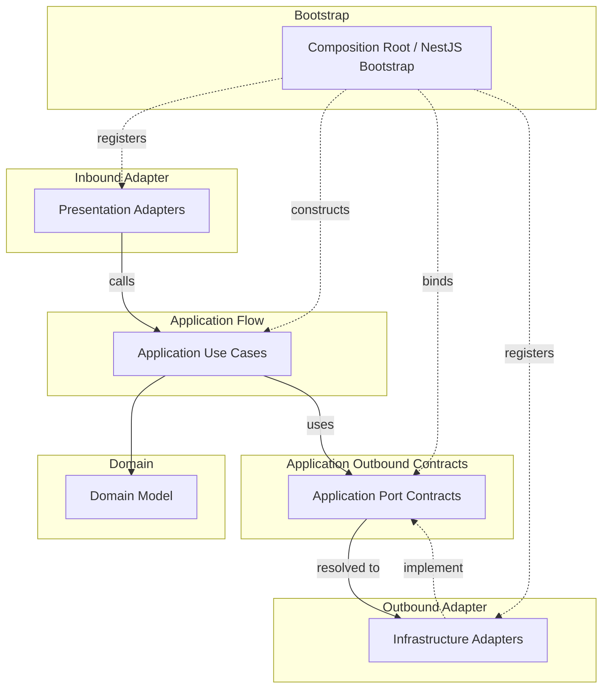

# API Runtime Wiring Convention

Runtime wiring rules decide where objects are created and how implementations are connected to ports.
Runtime wiring MUST NOT weaken source dependency rules.

## Runtime Flow And Wiring Map

This map shows runtime flow and provider binding, not source imports.
Solid arrows show runtime call/use direction.
Dotted arrows show provider registration, binding, or implementation.

## Composition Root

- `composition-root` contains application bootstrap and runtime wiring code.
- Use it for NestJS root modules, `main.ts`, runtime config loading, global filters, interceptors, guards, pipes, and app-level provider wiring.
- `composition-root` MAY depend on bounded contexts, adapters, layer kernels, `foundation`, frameworks, and external runtime libraries.
- `composition-root` MUST NOT contain business rules.
- Production code outside `composition-root` MUST NOT import `composition-root`.

## NestJS DI

- NestJS DI MAY be used as runtime wiring in `composition-root`, presentation adapters, or infrastructure adapters.
- NestJS DI MUST NOT create a source dependency from domain or application core to NestJS.
- Use framework decorators and provider registration in `composition-root`, presentation adapters, or infrastructure adapters, not in application core.
- Use provider factories or equivalent wiring to create application use cases without adding framework imports to application core.
- Application use cases SHOULD remain plain TypeScript classes constructed from explicit dependencies.

## Port Binding

- In this convention, `port` means an application-owned boundary contract by default.
- A port is not just any interface, error type, DTO, mapper, or shared contract.
- Runtime wiring MAY connect outer implementations to inner ports without making the inner source file import the outer implementation.
- Infrastructure adapters may implement application ports.
- `composition-root` or adapter wiring registers which implementation satisfies each port.
- Do not use runtime wiring as a reason to add forbidden imports to domain or application core.

## Non-Port Contracts

- Domain errors are domain contracts, not ports.
- Application errors are use case contracts, not ports.
- Presentation DTOs and mappers are protocol adapter contracts, not ports.
- Infrastructure error types and persistence mappers are adapter contracts, not ports.
- If an outer layer contract must be consumed by application core, move the contract inward and model it as an application port or application-kernel contract.
