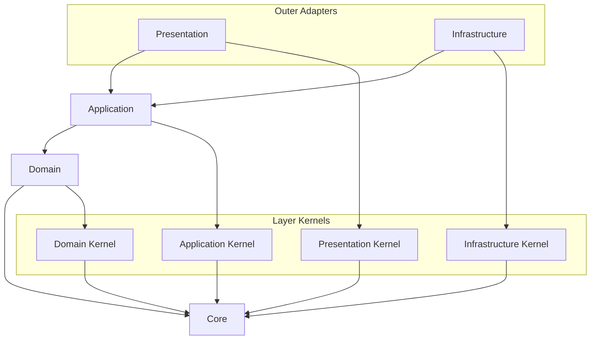

# API Source Dependency Convention

Source dependency rules decide what a source file may import.
Dependency direction MUST remain consistent from outer layers toward inner layers.

## Visual Dependency Map

Read every arrow as "the source may import the target."
If a dependency is not shown here and is not explicitly allowed in this document, treat it as forbidden by default.



The primary source direction is:

```text
presentation -> application -> domain -> core
infrastructure -> application -> domain -> core
```

## Forbidden Shortcuts

```text
domain -/-> application
domain -/-> infrastructure
domain -/-> presentation
domain -/-> bootstrap
application core -/-> infrastructure implementations
application core -/-> presentation DTOs
application core -/-> framework decorators
application core -/-> framework DI APIs
application core -/-> bootstrap concrete types
```

## Source Direction

- `core` does not depend on any project layer.
- Layer-kernel directories may depend on `core`.
- `domain` may depend on `core` and `layer-kernels/domain`.
- `application` may depend on `core`, `domain`, and `layer-kernels/application`.
- `infrastructure` may depend on `core`, `domain`, `application`, `layer-kernels/infrastructure`, and external libraries when implementing adapters.
- `presentation` may depend on `core`, `application`, `layer-kernels/presentation`, and framework libraries when handling external protocols.
- A bounded context root module, such as `contexts/{context-name}/{context-name}.module.ts`, MAY depend on that context's application, presentation, and infrastructure code to compose the feature.
- Production code outside `bootstrap` MUST NOT import `bootstrap`, except the thin `src/main.ts` entrypoint. Enforced by [`api-not-to-bootstrap-from-production`](../../dependency-cruiser/rules/runtime-wiring.cjs).
- Domain code MUST NOT import `bootstrap`, NestJS, database, HTTP, SDK, infrastructure, presentation, or application code. Enforced by [`api-domain-stays-inner`](../../dependency-cruiser/rules/source-dependency.cjs) and [`api-inner-layers-not-to-frameworks`](../../dependency-cruiser/rules/runtime-wiring.cjs).
- Application core MUST NOT import infrastructure implementations, presentation DTOs, framework decorators, framework DI APIs, or bootstrap concrete types. Enforced by [`api-application-stays-inner`](../../dependency-cruiser/rules/source-dependency.cjs) and [`api-inner-layers-not-to-frameworks`](../../dependency-cruiser/rules/runtime-wiring.cjs).

## Import Path Policy

- Project path aliases are declared only in [`apps/api/tsconfig.json`](../../tsconfig.json).
- TypeScript, Vitest, and dependency-cruiser MUST consume `tsconfig.json` instead of redefining project alias meaning.
- Path aliases represent stable architectural boundaries, not general path-shortening conveniences.
- Keep aliases limited to named source boundaries such as `@core/*`, `@layer-kernels/*`, `@contexts/*`, and `@bootstrap/*`.
- Do not add broad aliases such as `@api/*`, `@src/*`, or `@/*`.
- Production `src` imports MUST use alias imports when crossing source boundaries covered by `@core/*`, `@layer-kernels/*`, `@contexts/*`, or `@bootstrap/*`. Enforced by `api-local/import-path-style`.
- Prefer relative imports inside the same local implementation area.
- Use `index.ts` files as public surfaces for intentionally exported contracts, not as default folder decoration.
- Cross-boundary imports SHOULD target a public surface when one exists.
- Production imports into layer kernels, context domain code, and application ports MUST use their public surfaces. Enforced by [`api-not-to-layer-kernel-internals`](../../dependency-cruiser/rules/source-dependency.cjs), [`api-not-to-domain-internals`](../../dependency-cruiser/rules/source-dependency.cjs), and [`api-not-to-application-port-internals`](../../dependency-cruiser/rules/source-dependency.cjs).
- Deep imports into another context or layer internals are forbidden unless this document explicitly allows the dependency.

## Core

- `core` contains pure primitives that have no layer, framework, bounded context, or business vocabulary.
- Examples include `Result`, `Option`, `BaseError`, `assertNever`, and generic guards.
- Any layer MAY depend on `core`.
- `core` MUST NOT depend on project layers, frameworks, external SDKs, or business concepts. Enforced by [`api-core-is-independent`](../../dependency-cruiser/rules/source-dependency.cjs) and [`api-inner-layers-not-to-frameworks`](../../dependency-cruiser/rules/runtime-wiring.cjs).

## Domain Layer

- The domain layer contains business rules and domain models.
- Use it for entities, value objects, aggregates, domain services, domain events, and domain errors.
- Domain code MUST NOT know application, infrastructure, presentation, framework, database, HTTP, or SDK details.
- Domain code SHOULD express pure business behavior and invariants.
- Domain code may depend on `core` and `layer-kernels/domain`.

## Application Layer

- The application layer expresses use cases and application flow.
- Use it for commands, queries, use case handlers, application services, application-owned port interfaces, transaction boundaries, and application errors.
- Application core means use case flow and contracts, not NestJS module or provider registration.
- Application code uses domain models to execute user intent.
- Application code MUST NOT know infrastructure implementation details.
- Application code MUST NOT know presentation request or response DTO shapes.
- Application core MUST NOT depend on framework decorators or framework DI APIs.
- NestJS module files for application use case wiring belong at the bounded context root, not under `contexts/{context-name}/application`.
- Application code MAY convert domain errors and port errors into application or use case errors.
- Application core may depend on `core`, domain code, and `layer-kernels/application`.

## Infrastructure Layer

- The infrastructure layer implements technical adapters.
- Use it for database, ORM, external API, file system, message broker, SDK, and persistence code.
- Infrastructure code implements application-owned ports or domain/application contracts.
- Adapter code converts technology-specific errors, such as Prisma, TypeORM, HTTP client, SDK, or Drizzle errors, into port or infrastructure errors.
- Infrastructure code MAY depend on frameworks and external libraries.
- Infrastructure code does not need to know presentation code. Enforced by [`api-infrastructure-not-to-presentation-or-bootstrap`](../../dependency-cruiser/rules/source-dependency.cjs).

## Presentation Layer

- The presentation layer is the entry point for external requests and responses.
- Use it for controllers, resolvers, request DTOs, response DTOs, protocol mappers, and HTTP error mappers.
- Presentation code calls application use cases. Enforced by [`api-presentation-not-to-domain-infrastructure-or-bootstrap`](../../dependency-cruiser/rules/source-dependency.cjs).
- Presentation code converts application errors into protocol responses and applies masking policy.
- Presentation code SHOULD NOT expose domain or infrastructure errors directly to clients.
- Presentation code MAY depend on frameworks and protocol libraries.

## Kernel Directories

- `layer-kernels/domain` contains common domain-layer policy only.
- `layer-kernels/application` contains common application-layer contracts only.
- `layer-kernels/infrastructure` contains common infrastructure adapter policy only.
- `layer-kernels/presentation` contains common presentation-layer policy only.
- Layer-kernel directories MAY depend on `core`.
- Layer-kernel directories MUST NOT depend on bounded contexts, bootstrap code, framework code, or outer layers. Enforced by [`api-layer-kernels-stay-in-layer`](../../dependency-cruiser/rules/source-dependency.cjs) and [`api-inner-layers-not-to-frameworks`](../../dependency-cruiser/rules/runtime-wiring.cjs).
- Kernel directories MUST NOT become generic utility buckets.
- Feature-specific policy belongs inside the owning bounded context.
