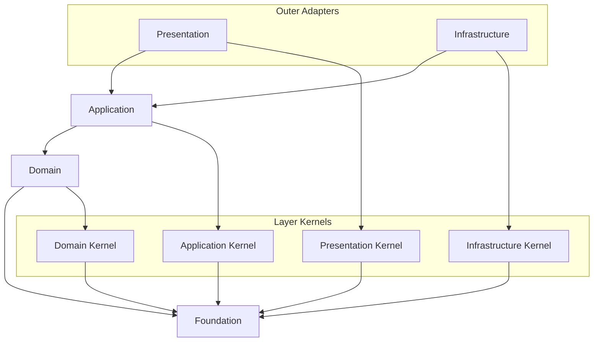

# API Source Dependency Convention

Source dependency rules decide what a source file may import.
Dependency direction MUST remain consistent from outer layers toward inner layers.

## Visual Dependency Map

Read every arrow as "the source may import the target."
If a dependency is not shown here and is not explicitly allowed in this document, treat it as forbidden by default.



The core source direction is:

```text
presentation -> application -> domain -> foundation
infrastructure -> application -> domain -> foundation
```

## Forbidden Shortcuts

```text
domain -/-> application
domain -/-> infrastructure
domain -/-> presentation
domain -/-> composition-root
application core -/-> infrastructure implementations
application core -/-> presentation DTOs
application core -/-> framework decorators
application core -/-> composition-root concrete types
```

## Source Direction

- `foundation` does not depend on any project layer.
- Layer-kernel directories may depend on `foundation`.
- `domain` may depend on `foundation` and `layer-kernels/domain`.
- `application` may depend on `foundation`, `domain`, and `layer-kernels/application`.
- `infrastructure` may depend on `foundation`, `domain`, `application`, `layer-kernels/infrastructure`, and external libraries when implementing adapters.
- `presentation` may depend on `foundation`, `application`, `layer-kernels/presentation`, and framework libraries when handling external protocols.
- Production code outside `composition-root` MUST NOT import `composition-root`.
- Domain code MUST NOT import `composition-root`, NestJS, database, HTTP, SDK, infrastructure, presentation, or application code.
- Application core MUST NOT import infrastructure implementations, presentation DTOs, framework decorators, framework DI APIs, or composition-root concrete types.

## Foundation

- `foundation` contains pure primitives that have no layer, framework, bounded context, or business vocabulary.
- Examples include `Result`, `Option`, `BaseError`, `assertNever`, and generic guards.
- Any layer MAY depend on `foundation`.
- `foundation` MUST NOT depend on project layers, frameworks, external SDKs, or business concepts.

## Domain Layer

- The domain layer contains business rules and domain models.
- Use it for entities, value objects, aggregates, domain services, domain events, and domain errors.
- Domain code MUST NOT know application, infrastructure, presentation, framework, database, HTTP, or SDK details.
- Domain code SHOULD express pure business behavior and invariants.
- Domain code may depend on `foundation` and `layer-kernels/domain`.

## Application Layer

- The application layer expresses use cases and application flow.
- Use it for commands, queries, use case handlers, application services, application-owned port interfaces, transaction boundaries, and application errors.
- Application code uses domain models to execute user intent.
- Application code MUST NOT know infrastructure implementation details.
- Application code MUST NOT know presentation request or response DTO shapes.
- Application core MUST NOT depend on framework decorators or framework DI APIs.
- Application code MAY convert domain errors and port errors into application or use case errors.
- Application core may depend on `foundation`, domain code, and `layer-kernels/application`.

## Infrastructure Layer

- The infrastructure layer implements technical adapters.
- Use it for database, ORM, external API, file system, message broker, SDK, and persistence code.
- Infrastructure code implements application-owned ports or domain/application contracts.
- Adapter code converts technology-specific errors, such as Prisma, TypeORM, HTTP client, SDK, or Drizzle errors, into port or infrastructure errors.
- Infrastructure code MAY depend on frameworks and external libraries.
- Infrastructure code does not need to know presentation code.

## Presentation Layer

- The presentation layer is the entry point for external requests and responses.
- Use it for controllers, resolvers, request DTOs, response DTOs, protocol mappers, and HTTP error mappers.
- Presentation code calls application use cases.
- Presentation code converts application errors into protocol responses and applies masking policy.
- Presentation code SHOULD NOT expose domain or infrastructure errors directly to clients.
- Presentation code MAY depend on frameworks and protocol libraries.

## Kernel Directories

- `layer-kernels/domain` contains common domain-layer policy only.
- `layer-kernels/application` contains common application-layer contracts only.
- `layer-kernels/infrastructure` contains common infrastructure adapter policy only.
- `layer-kernels/presentation` contains common presentation-layer policy only.
- Layer-kernel directories MAY depend on `foundation`.
- Layer-kernel directories MUST NOT depend on bounded contexts, composition-root code, framework code, or outer layers.
- Kernel directories MUST NOT become generic utility buckets.
- Feature-specific policy belongs inside the owning bounded context.
