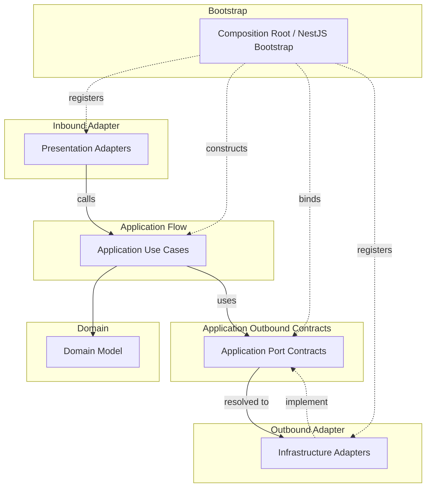

# API Runtime Wiring 컨벤션

Runtime wiring rule은 object를 어디에서 만들고 implementation을 port에 어떻게 연결하는지 판단한다.
Runtime wiring은 source dependency rule을 약화시키면 안 된다.

## Runtime Flow And Wiring Map

이 map은 source import가 아니라 runtime flow와 provider binding을 보여준다.
실선 화살표는 runtime call/use direction을 뜻한다.
점선 화살표는 provider registration, binding, implementation을 뜻한다.

## Composition Root

- `composition-root`는 application bootstrap과 runtime wiring code를 담는다.
- NestJS root module, `main.ts`, runtime config loading, global filter, interceptor, guard, pipe, app-level provider wiring에 사용한다.
- `composition-root`는 bounded context, adapter, layer kernel, `foundation`, framework, external runtime library에 의존할 수 있다.
- `composition-root`는 business rule을 담으면 안 된다.
- `composition-root` 외부의 production code는 `composition-root`를 import하면 안 된다.

## NestJS DI

- NestJS DI는 `composition-root`, presentation adapter, infrastructure adapter에서 runtime wiring으로 사용할 수 있다.
- NestJS DI 때문에 domain 또는 application core에서 NestJS로 source dependency가 생기면 안 된다.
- Framework decorator와 provider registration은 application core가 아니라 `composition-root`, presentation adapter, infrastructure adapter에서 사용한다.
- Provider factory 또는 동등한 wiring을 사용해 application core에 framework import를 추가하지 않고 application use case를 생성한다.
- Application use case는 explicit dependency로 생성되는 plain TypeScript class로 유지하는 것이 좋다.

## Port Binding

- 이 컨벤션에서 `port`는 기본적으로 application-owned boundary contract를 뜻한다.
- port는 모든 interface, error type, DTO, mapper, shared contract를 뜻하지 않는다.
- Runtime wiring은 inner source file이 outer implementation을 import하지 않게 유지하면서 outer implementation을 inner port에 연결할 수 있다.
- Infrastructure adapter는 application port를 구현할 수 있다.
- `composition-root` 또는 adapter wiring이 각 port를 만족하는 implementation을 등록한다.
- runtime wiring을 이유로 domain 또는 application core에 금지된 import를 추가하면 안 된다.

## Non-Port Contracts

- Domain error는 domain contract이지 port가 아니다.
- Application error는 use case contract이지 port가 아니다.
- Presentation DTO와 mapper는 protocol adapter contract이지 port가 아니다.
- Infrastructure error type과 persistence mapper는 adapter contract이지 port가 아니다.
- Outer layer contract를 application core가 소비해야 한다면, 그 contract를 안쪽으로 옮겨 application port 또는 application-kernel contract로 모델링한다.
