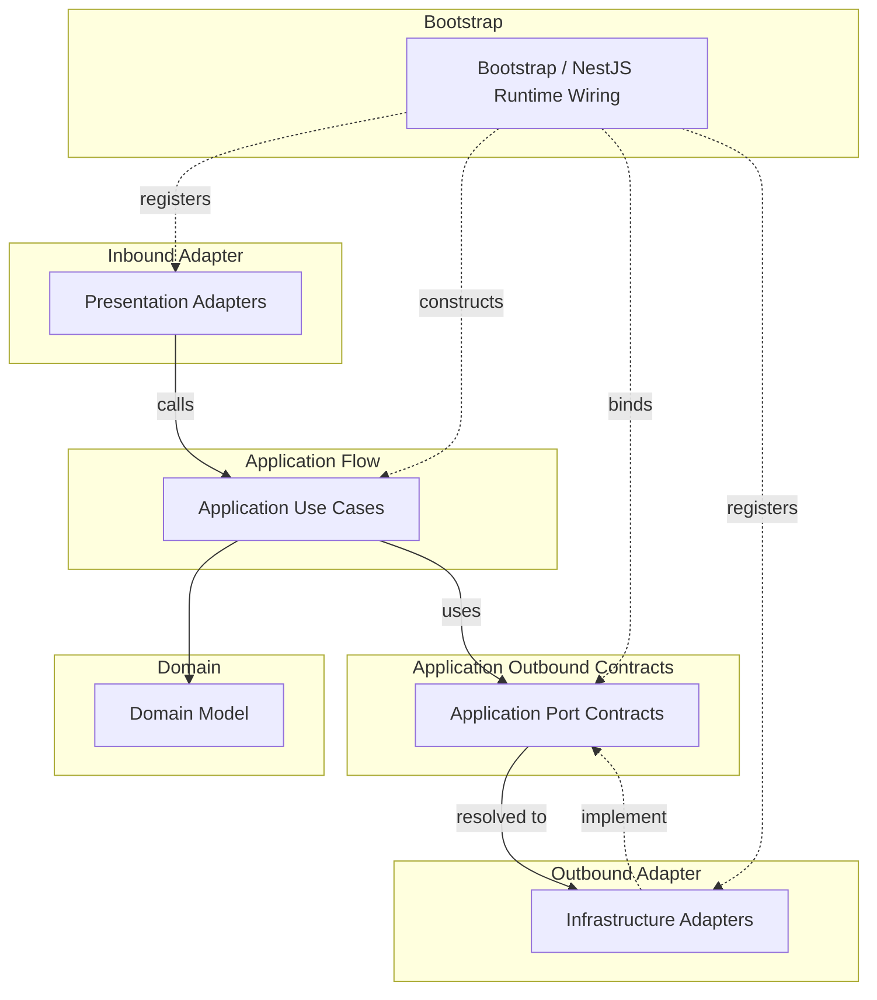

# API Runtime Wiring 컨벤션

Runtime wiring rule은 object를 어디에서 만들고 implementation을 port에 어떻게 연결하는지 판단한다.
Runtime wiring은 source dependency rule을 약화시키면 안 된다.

## Runtime Flow And Wiring Map

이 map은 source import가 아니라 runtime flow와 provider binding을 보여준다.
실선 화살표는 runtime call/use direction을 뜻한다.
점선 화살표는 provider registration, binding, implementation을 뜻한다.

## Bootstrap

- `bootstrap`는 application bootstrap과 runtime wiring code를 담는다.
- `src/main.ts`는 bootstrap runtime code에 위임하는 얇은 process entrypoint로 둔다.
- `bootstrap`는 NestJS root module, bootstrap function, runtime config loading, global filter, interceptor, guard, pipe, app-level provider wiring에 사용한다.
- `bootstrap`는 bounded context, adapter, layer kernel, `core`, framework, external runtime library에 의존할 수 있다.
- `bootstrap`는 business rule을 담으면 안 된다.
- 얇은 `src/main.ts` entrypoint를 제외한 `bootstrap` 외부의 production code는 `bootstrap`를 import하면 안 된다. [`api-not-to-bootstrap-from-production`](../../dependency-cruiser/rules/runtime-wiring.cjs)이 강제한다.

## Environment Configuration

- Environment variable definition은 그 값을 사용하는 boundary에 둔다.
- Local API runtime value는 `apps/api/.env`에 두며, 이 파일은 commit하면 안 된다.
- `NODE_ENV`는 Node runtime mode다. 허용 값은 `development`, `test`, `production`이고, 기본값은 `development`다.
- `APP_ENV`는 API app environment selector다. 허용 값은 `local`, `development`, `test`, `production`이고, 기본값은 `local`이다.
- Environment variable의 owner는 schema, default, typed config mapper, owner-specific validation rule을 정의하는 것이 좋다.
- `bootstrap`는 app-level 및 selection-level environment schema를 집계하고 process startup 시점에 API runtime validation을 실행한다.
- Adapter-specific required environment variable은 선택된 adapter가 typed config를 만들 때 검증하는 것이 좋다.
- Conditional module registration처럼 raw `process.env`를 확인해야 하는 runtime wiring은 string comparison을 중복하지 말고 owner-provided selector helper를 호출하는 것이 좋다.
- Production code는 validation 후 raw `process.env`를 직접 읽지 말고 typed config provider 또는 `ConfigService` value를 소비하는 것이 좋다.

## NestJS DI

- NestJS DI는 `bootstrap`, presentation adapter, infrastructure adapter에서 runtime wiring으로 사용할 수 있다.
- NestJS DI 때문에 domain 또는 application core에서 NestJS로 source dependency가 생기면 안 된다. [`api-inner-layers-not-to-frameworks`](../../dependency-cruiser/rules/runtime-wiring.cjs)가 강제한다.
- Framework decorator와 provider registration은 application core가 아니라 `bootstrap`, presentation adapter, infrastructure adapter에서 사용한다.
- Provider factory 또는 동등한 wiring을 사용해 application core에 framework import를 추가하지 않고 application use case를 생성한다.
- Application use case는 explicit dependency로 생성되는 plain TypeScript class로 유지하는 것이 좋다.
- Bounded context root module은 해당 context의 application, presentation, infrastructure provider를 조립할 수 있다.
- NestJS provider는 use case folder마다 module을 복제하기보다 bounded context 또는 runtime boundary 단위로 조립하는 것을 선호한다.

## Port Binding

- 이 컨벤션에서 `port`는 기본적으로 application-owned boundary contract를 뜻한다.
- port는 모든 interface, error type, DTO, mapper, shared contract를 뜻하지 않는다.
- Runtime wiring은 inner source file이 outer implementation을 import하지 않게 유지하면서 outer implementation을 inner port에 연결할 수 있다.
- Infrastructure adapter는 application port를 구현할 수 있다.
- `bootstrap` 또는 adapter wiring이 각 port를 만족하는 implementation을 등록한다.
- runtime wiring을 이유로 domain 또는 application core에 금지된 import를 추가하면 안 된다. [`api-domain-stays-inner`](../../dependency-cruiser/rules/source-dependency.cjs), [`api-application-stays-inner`](../../dependency-cruiser/rules/source-dependency.cjs), [`api-inner-layers-not-to-frameworks`](../../dependency-cruiser/rules/runtime-wiring.cjs)가 강제한다.

## Non-Port Contracts

- Domain error는 domain contract이지 port가 아니다.
- Application error는 use case contract이지 port가 아니다.
- Presentation DTO와 mapper는 protocol adapter contract이지 port가 아니다.
- Infrastructure error type과 persistence mapper는 adapter contract이지 port가 아니다.
- Outer layer contract를 application core가 소비해야 한다면, 그 contract를 안쪽으로 옮겨 application port 또는 application-kernel contract로 모델링한다.
