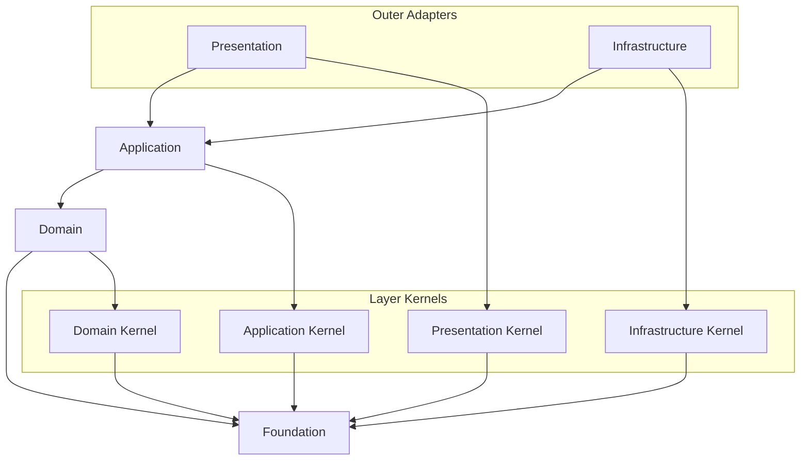

# API Source Dependency 컨벤션

Source dependency rule은 source file이 무엇을 import할 수 있는지 판단한다.
의존성 방향은 outer layer에서 inner layer로 일관되게 유지해야 한다.

## 시각적 의존성 지도

모든 화살표는 "source가 target을 import할 수 있다"는 뜻으로 읽는다.
여기에 표시되지 않았고 이 문서에서 명시적으로 허용하지 않은 의존성은 기본적으로 금지된 것으로 본다.



핵심 source direction은 다음과 같다.

```text
presentation -> application -> domain -> foundation
infrastructure -> application -> domain -> foundation
```

## 금지되는 Shortcut

```text
domain -/-> application
domain -/-> infrastructure
domain -/-> presentation
domain -/-> composition-root
application core -/-> infrastructure implementations
application core -/-> presentation DTOs
application core -/-> framework decorators
application core -/-> composition-root concrete types
```

## Source Direction

- `foundation`은 어떤 project layer에도 의존하지 않는다.
- Layer-kernel directory는 `foundation`에 의존할 수 있다.
- `domain`은 `foundation`과 `layer-kernels/domain`에 의존할 수 있다.
- `application`은 `foundation`, `domain`, `layer-kernels/application`에 의존할 수 있다.
- `infrastructure`는 adapter 구현 시 `foundation`, `domain`, `application`, `layer-kernels/infrastructure`, external library에 의존할 수 있다.
- `presentation`은 external protocol 처리 시 `foundation`, `application`, `layer-kernels/presentation`, framework library에 의존할 수 있다.
- `composition-root` 외부의 production code는 `composition-root`를 import하면 안 된다.
- Domain code는 `composition-root`, NestJS, database, HTTP, SDK, infrastructure, presentation, application code를 import하면 안 된다.
- Application core는 infrastructure implementation, presentation DTO, framework decorator, framework DI API, composition-root concrete type을 import하면 안 된다.

## Foundation

- `foundation`은 layer, framework, bounded context, business vocabulary가 없는 pure primitive를 담는다.
- 예: `Result`, `Option`, `BaseError`, `assertNever`, generic guard.
- 모든 layer는 `foundation`에 의존할 수 있다.
- `foundation`은 project layer, framework, external SDK, business concept에 의존하면 안 된다.

## Domain Layer

- domain layer는 business rule과 domain model을 담는다.
- entity, value object, aggregate, domain service, domain event, domain error에 사용한다.
- Domain code는 application, infrastructure, presentation, framework, database, HTTP, SDK detail을 알면 안 된다.
- Domain code는 pure business behavior와 invariant를 표현하는 것이 좋다.
- Domain code는 `foundation`과 `layer-kernels/domain`에 의존할 수 있다.

## Application Layer

- application layer는 use case와 application flow를 표현한다.
- command, query, use case handler, application service, application-owned port interface, transaction boundary, application error에 사용한다.
- Application code는 domain model을 사용해 user intent를 실행한다.
- Application code는 infrastructure implementation detail을 알면 안 된다.
- Application code는 presentation request 또는 response DTO shape를 알면 안 된다.
- Application core는 framework decorator 또는 framework DI API에 의존하면 안 된다.
- Application code는 domain error와 port error를 application 또는 use case error로 변환할 수 있다.
- Application core는 `foundation`, domain code, `layer-kernels/application`에 의존할 수 있다.

## Infrastructure Layer

- infrastructure layer는 technical adapter를 구현한다.
- database, ORM, external API, file system, message broker, SDK, persistence code에 사용한다.
- Infrastructure code는 application-owned port 또는 domain/application contract를 구현한다.
- Adapter code는 Prisma, TypeORM, HTTP client, SDK, Drizzle error 같은 technology-specific error를 port 또는 infrastructure error로 변환한다.
- Infrastructure code는 framework와 external library에 의존할 수 있다.
- Infrastructure code는 presentation code를 알 필요가 없다.

## Presentation Layer

- presentation layer는 external request와 response의 entry point다.
- controller, resolver, request DTO, response DTO, protocol mapper, HTTP error mapper에 사용한다.
- Presentation code는 application use case를 호출한다.
- Presentation code는 application error를 protocol response로 변환하고 masking policy를 적용한다.
- Presentation code는 domain 또는 infrastructure error를 client에 직접 노출하지 않는 것이 좋다.
- Presentation code는 framework와 protocol library에 의존할 수 있다.

## Kernel Directories

- `layer-kernels/domain`은 domain-layer 공통 policy만 담는다.
- `layer-kernels/application`은 application-layer 공통 contract만 담는다.
- `layer-kernels/infrastructure`는 infrastructure 공통 adapter policy만 담는다.
- `layer-kernels/presentation`은 presentation-layer 공통 policy만 담는다.
- Layer-kernel directory는 `foundation`에 의존할 수 있다.
- Layer-kernel directory는 bounded context, composition-root code, framework code, outer layer에 의존하면 안 된다.
- Kernel directory는 generic utility bucket이 되면 안 된다.
- Feature-specific policy는 소유 bounded context 내부에 둔다.
